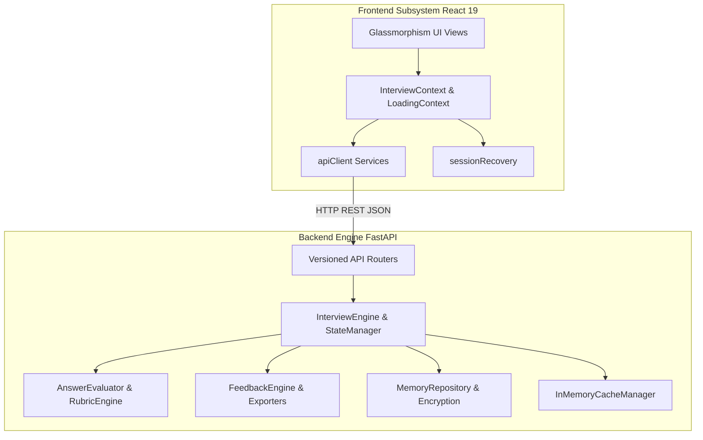

# 🎙️ ABTalks AI Interview Agent

[](https://github.com/VemireddyBhavana/abtalks/actions/workflows/ci.yml)
[](LICENSE)
[](https://react.dev/)
[](https://fastapi.tiangolo.com/)

A production-ready, full-stack **AI Interview Agent** built for the **ABTalks AI Interview Agent Hackathon**. The platform conducts multi-turn technical interviews, evaluates candidate responses across weighted rubrics, and delivers actionable feedback scorecards.

---

## 📌 Project Overview

The **ABTalks AI Interview Agent** integrates a React 19 frontend UI with a Python FastAPI backend engine without modifying core business logic or breaking API contracts:

- 🎙️ **Interactive Interview Sessions**: Conducts 8-question structured interviews spanning multi-day curriculum topics.
- 📊 **Candidate Analytics & Scorecards**: Computes weighted scores across 7 technical dimensions and generates prioritized recommendations.
- 🔄 **Session Recovery & Resilience**: Restores active state after browser refreshes or network drops.
- 🛡️ **OWASP Security Hardening**: Implements strict security response headers, payload size limits (2MB), and XSS input sanitization.
- ⚡ **Observability & Latency Monitoring**: Injects `X-Process-Time` timing headers and provides centralized performance diagnostics.

---

## 🏗️ System Architecture



---

## 📁 Repository Navigation & Documentation

Detailed technical documentation is available in the [`docs/`](docs/) directory:

- 📘 [**Architecture Overview**](docs/architecture.md): Subsystem design, sequence diagrams, and design patterns.
- 🔌 [**API Endpoint Reference**](docs/api_reference.md): Complete OpenAPI REST API endpoint specifications.
- 🗺️ [**Project Structure Map**](docs/project_structure.md): Comprehensive directory tree breakdown.
- 💻 [**Developer Onboarding Guide**](docs/developer_guide.md): Local environment setup and testing workflow.
- 🌐 [**Production Deployment Guide**](docs/deployment.md): Instructions for Vercel and Render/Railway.
- 🧪 [**Comprehensive Testing Strategy**](docs/testing_strategy.md): Pytest, Vitest, and E2E testing details.
- 🛡️ [**Security Architecture**](docs/security.md): Security headers, CORS policy, and dependency audit.
- ⚡ [**Performance & Benchmarking**](docs/performance.md): Latency metrics, caching, and Lighthouse targets.
- ♿ [**Accessibility (a11y) Checklist**](docs/accessibility.md): WCAG compliance and keyboard navigation.
- 📋 [**Quality Assurance & QA Guide**](docs/quality_assurance.md): Test workflow and release checklists.
- 🚀 [**Production Release Checklist**](docs/release_checklist.md): Pre-release quality gate checklist.
- 🏛️ [**Full System Validation**](docs/system_validation.md): Final architectural validation matrix.
- 📜 [**Hackathon Presentation Script**](docs/demo_script.md): Live demo presentation script.
- 🤖 [**AI Usage & Prompt Engineering Log**](ai-usage-log.md): Record of AI assistance across all 12 phases.

---

## 🚀 Quickstart & Local Setup

### 1️⃣ Prerequisites
- **Node.js**: v20.x or later
- **Python**: 3.12 or later

---

### 2️⃣ Frontend Setup
```bash
cd frontend
npm install
npm run dev
```
Access the React frontend at `http://localhost:5173`.

Run Frontend Tests:
```bash
npm run test
```

Build for Production:
```bash
npm run build
```

---

### 3️⃣ Backend Setup
```bash
cd backend
python -m venv .venv
.\.venv\Scripts\Activate.ps1   # On Windows
pip install -r requirements.txt
uvicorn app.main:app --reload --port 8000
```
Access FastAPI Swagger Documentation at `http://localhost:8000/docs`.

Run Backend Pytest Suite:
```bash
python -m pytest -v
```

---

## 🌐 Production Deployment Targets

- **Frontend**: Deployed on **Vercel** (`frontend/vercel.json`).
- **Backend**: Deployed on **Render / Railway** (`backend/render.yaml` / `backend/Procfile`).

---

## 📄 License & Team Information

- **License**: [MIT License](LICENSE)
- **Developed for**: ABTalks AI Interview Agent Hackathon
