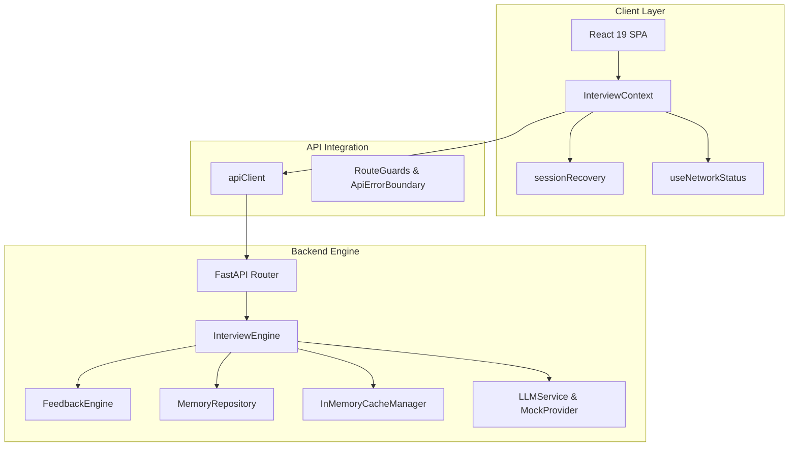

# Full-Stack System Architecture

This document describes the high-level system architecture, design patterns, and subsystem interactions of the **ABTalks AI Interview Agent**.

---

## 🏗️ High-Level System Architecture

---

## 🧩 Architectural Design Patterns

1. **Strategy Pattern**:
   - Used in `InterviewEngine` (`StandardInterviewStrategy`, `FutureAdaptiveStrategy`) and `FeedbackEngine` (`TechnicalFeedbackStrategy`, `BehavioralFeedbackStrategy`).
2. **Factory Pattern**:
   - `InterviewFactory`, `MemoryFactory`, and `LLMProviderFactory` construct interface implementations cleanly.
3. **Singleton Pattern**:
   - `InMemoryCacheManager`, `MetricsRegistry`, and `PerformanceMonitor` maintain centralized state.
4. **Repository Pattern**:
   - `MemoryRepository` decouples storage providers from business logic.
