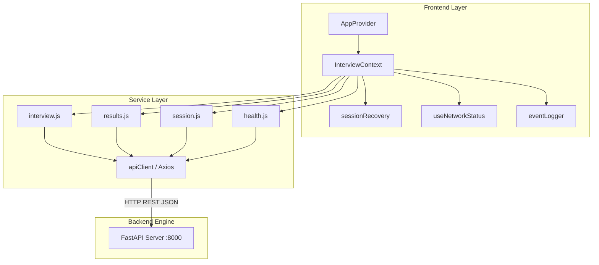

# Integration Subsystem Architecture

This document describes the design, API flow, session lifecycle, recovery strategy, and offline resilience of the **Frontend–Backend Integration Subsystem** (Phase 10) in the **ABTalks AI Interview Agent**.

---

## 🏗️ Architectural Overview

The integration layer connects the React 19 frontend UI with the FastAPI backend engine without modifying existing API endpoints.

---

## 🔑 Key Architectural Components

### 1. `apiClient` (`frontend/src/services/apiClient.js`)
- Base Axios client with 15s timeout, transient 5xx retry logic with exponential backoff, request/response dev logging, and OAuth bearer headers.

### 2. `sessionRecovery` (`frontend/src/services/sessionRecovery.js`)
- Detects active session IDs in `localStorage`. Automatically recovers session turn state via `GET /api/v1/interview/{sessionId}/state` upon browser refresh or network reconnects.

### 3. `health.js` (`frontend/src/services/health.js`)
- Pings `GET /health` and tracks ping response latency in milliseconds (`latencyMs`).

### 4. `useNetworkStatus` (`frontend/src/hooks/useNetworkStatus.js`)
- Monitors browser `online` and `offline` events, enabling automatic retries when internet connectivity returns.

### 5. `eventLogger` (`frontend/src/services/eventLogger.js`)
- Logs structured events (`Interview started`, `Question viewed`, `Answer submitted`, `Interview completed`, `API errors`) during development.

---

## 🔮 Future Extensibility

The integration layer is designed for future scaling:
- **Authentication**: `Authorization: Bearer <token>` interceptor placeholder ready for OAuth2/JWT.
- **WebSockets**: Pluggable event listener hooks ready for real-time streaming question evaluation.
- **Multi-Device Resume**: `sessionRecovery` payload format aligns with cloud session stores.
