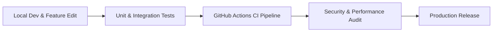

# Quality Assurance & Release Engineering Guide

This document outlines the Quality Assurance (QA) workflow, security standards, performance benchmarks, accessibility criteria, release checklist, and long-term maintainability strategy for the **ABTalks AI Interview Agent**.

---

## 1. 🔄 Testing Workflow

### Pre-Commit / Pre-Push Routine
1. **Backend Tests**: `cd backend && python -m pytest -v` (Must achieve 100% pass rate).
2. **Frontend Tests**: `cd frontend && npm run test` (Must achieve 100% pass rate).
3. **Production Build**: `cd frontend && npm run build` (Must build cleanly without warnings or errors).

---

## 2. ⚡ Performance Checklist & Lighthouse Guidelines

### Latency & Throughput Benchmarks
- [x] Backend API Health response latency `< 100ms`.
- [x] In-Memory Cache lookups executing with zero disk-read delay.
- [x] Frontend dynamic code-splitting configured with Vite rollup manual chunks (`vendor`, `ui`, route chunks).

### Lighthouse Performance Targets
- **Performance**: `>= 90`
- **Accessibility**: `>= 95`
- **Best Practices**: `>= 95`
- **SEO**: `>= 95`

---

## 3. 🛡️ Security Audit Checklist

- [x] OWASP Response Headers (`X-Content-Type-Options`, `X-Frame-Options`, `Strict-Transport-Security`, `Content-Security-Policy`).
- [x] 2MB Max HTTP Payload Limit (`RequestSizeLimitMiddleware`).
- [x] Restricted CORS origin policies (`GET`, `POST`, `OPTIONS`).
- [x] Input Sanitization (`sanitizeInput`) against HTML/XSS injection.
- [x] Diagnostic tool `SecurityAudit.run_audit()` executed before releases.

---

## 4. ♿ Accessibility (a11y) Checklist

- [x] All buttons and controls provide visible focus indicators (`focus-visible:ring-emerald-400`).
- [x] Form controls include `aria-label` or explicit `<label>` tags.
- [x] Dynamic updates use `aria-live="polite"` or `role="alert"`.
- [x] Reduced motion styles supported via `motion-reduce:transition-none`.

---

## 5. 🚀 Production Release Checklist

- [ ] Run `python -m pytest -v` in `backend/` — All tests pass.
- [ ] Run `npm run test` in `frontend/` — All tests pass.
- [ ] Run `npm run build` in `frontend/` — Production build completes cleanly.
- [ ] Execute `SecurityAudit.run_audit()` — Zero security warnings reported.
- [ ] Check `HealthDashboardService.get_dashboard_status()` — Status reported as `healthy`.
- [ ] Push commit to GitHub `main` branch — GitHub Actions CI pipeline passes green.

---

## 6. 🏗️ Long-Term Maintainability & Production Readiness

Each improvement introduced in Phase 11 reinforces long-term maintainability:
- **`PerformanceMonitor` & `HealthDashboardService`**: Provide operational visibility for monitoring server health and identifying latency degradation before impact on candidates.
- **`SecurityAudit`**: Prevents accidental exposure of unsafe configurations (such as active DEBUG flags or wildcard CORS) during deployment cycles.
- **Reusable Test Factories (`factories.py` & `testUtils.jsx`)**: Reduce test boilerplate and standardize mock state generation across developer teams.
- **Automated CI/CD Workflows**: Ensure that broken code or failing tests are caught automatically on every push or pull request prior to production deployment.
