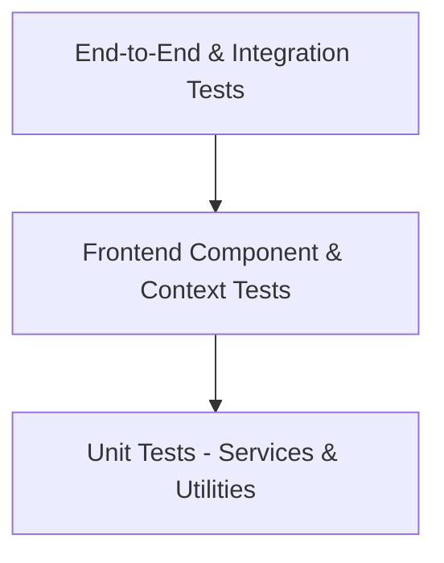

# Comprehensive Testing Strategy

This document details the testing strategy for the **ABTalks AI Interview Agent** across backend Python services and frontend React components.

---

## 🧪 Testing Pyramid



---

## 🐍 Backend Pytest Suite

### Directory: `backend/tests/`

- **Unit Tests**:
  - `test_services.py`: `CurriculumService`, `CandidateService`, `InMemoryCacheManager`.
  - `test_llm.py` / `test_llm_service.py`: Prompt generation, token tracking, safety filtering, cache.
  - `test_memory.py` / `test_memory_service.py`: Repository CRUD, snapshot creation, encryption.
  - `test_feedback.py` / `test_feedback_engine.py`: Score calculator, rubric engine, exporters.

- **Integration & E2E Tests**:
  - `test_api.py` & `test_phase3_api.py`: FastAPI routes (`/health`, `/curriculum`, `/candidate`).
  - `test_interview_flow.py`: Full multi-turn session lifecycle (`/start` -> `/answer` -> `/state`).
  - `test_security.py`: Security headers, payload size limiters (2MB cap).
  - `test_performance.py`: Response latency benchmarks (<100ms for health checks).

### Running Backend Tests
```bash
cd backend
.\.venv\Scripts\python.exe -m pytest -v
```

---

## ⚛️ Frontend Vitest Suite

### Directory: `frontend/tests/`

- **Component & Error Handling**:
  - `ApiErrorBoundary.test.jsx`: Catching API communication failures & rendering fallback UI.
  - `RouteGuards.test.jsx`: Redirect logic for missing sessions & feedback reports.

- **Hooks & Services**:
  - `useNetworkStatus.test.js`: Online/offline status detection & reconnection triggers.
  - `apiClient.test.js`: Request/response interceptors, timeouts, input sanitization (`sanitizeInput`).

### Running Frontend Tests
```bash
cd frontend
npm run test
```
